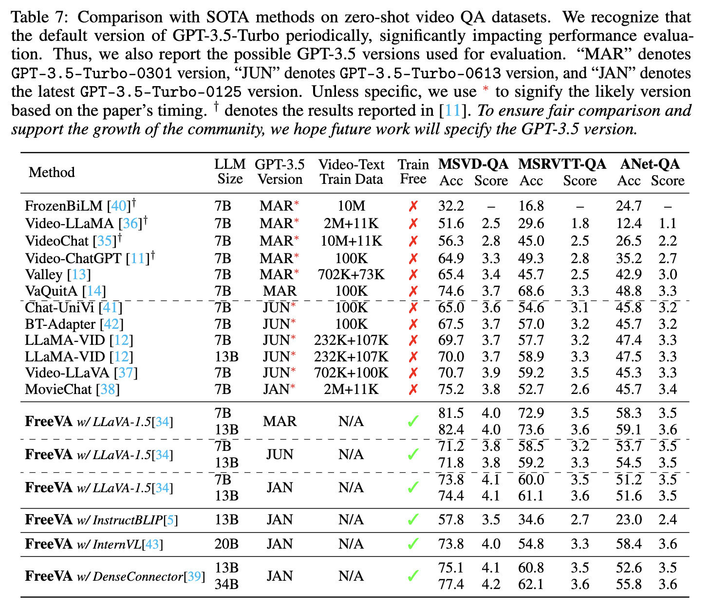

<div align="center">

<h2>FreeVA: Offline MLLM as Training-Free Video Assistant</h2> 


[](https://arxiv.org/abs/2405.07798)

#### [Wenhao Wu](https://whwu95.github.io/)

#### [The University of Sydney](https://www.sydney.edu.au/)

<h5 align="center"> If you like our project, please give us a star ⭐ on GitHub for latest update.  </h5>
</div>

***


Welcome to **FreeVA** - a plug-and-play, simple yet effective study exploring the utilization of existing image MLLMs as video conversational models in a training-free manner. ⚡The core code can be just one line!


## Main Take-aways💡
The study provides an essential, yet must-know baseline, and reveals several surprising findings: 
1) 😄FreeVA, leveraging only offline image-based MLLM without additional training, excels in zero-shot video question-answering (e.g., MSVD-QA, ActivityNet-QA, and MSRVTT-QA), even surpassing state-of-the-art methods that involve video instruction tuning. 
2) 🤔While mainstream video-based MLLMs typically initialize with an image-based MLLM (\eg, LLaVA) and then fine-tune using video instruction tuning, the study indicates that utilizing the widely adopted VideoInstruct-100K for video instruction tuning doesn't actually lead to better performance compared to not training at all.
3) ⚠️The commonly used evaluation metrics in existing works are significantly influenced by changes in the GPT-3.5 API version over time. If ignored, this could affect the fairness and uniformity of comparisons between different methods and impact the analysis and judgment of researchers in the field.


## 📢News
- [x] **[May 14, 2024]** [Preprint](https://arxiv.org/pdf/2405.07798) has been released.
- [x] **[May 13, 2024]** Code has been released. Thanks for your star 😝.


## Overview

<div align="center">
An illustration of (a) an overview of the image MLLM inference process and (b) our proposed FreeVA for zero-shot video inference using existing image MLLMs.





</div>


## Empirical Study📊

<div align="center">


</div>


## Running Video QA💬

FreeVA can be applied to any image-based MLLM, and its core code is straightforward, simply involving a temporal aggregation. Please refer to [temporal_aggregation](./llava/model/llava_arch.py#L148) for implementation details. 

Below, we provide guidance on running the code using LLaVA-1.5 as an example. 

Before running:
1) Please refer to [cog.yaml](./cog.yaml) for environment configuration regarding LLaVA-1.5.
2) Please download the LLaVA model in advance and place it in the "ckpt" folder, for example, "llava-v1.5-7b" or "llava-v1.5-13b".
3) Please refer to [Video-ChatGPT](https://github.com/mbzuai-oryx/Video-ChatGPT) for downloading the evaluation dataset and corresponding annotations.

### Zero-shot Video Question-Answering
To enhance evaluation efficiency, we provide a script for single-machine *multi-GPU* evaluation. Taking the ActivityNet-QA dataset as an example, the specific steps to run the script are as follows:

**Step1: Obtain the prediction file.**
```sh
CUDA_VISIBLE_DEVICES=0,1,2,3,4,5,6,7 bash scripts/infer_video/run_qa_anet_7B.sh
```
You will get a predtion file *merge.jsonl*.

**Step2: GPT-assistant evaluation**

Running the following command will provide you with accuracy and score. 
Before running, please fill in your OpenAI API Key, the prediction file address for Step 1, the number of worker processes for multiprocessing (to accelerate inference), and the version number of GPT-3.5.

⚠️*Note: The default version of gpt-3.5-turbo has been updated three times in chronological order: gpt-3.5-turbo-0301, gpt-3.5-turbo-0613, gpt-3.5-turbo-0125, with significant performance differences between versions.*
```sh
bash scripts/gpt_eval/eval_qa_activitynet.sh
```

*The evaluation process for other datasets (MSRVTT-QA, MSVD-QA) follows the same procedure. Please refer to the steps outlined above.*

### Video-Based Text Generation Performance

The generative performance benchmark, include five evaluation metrics such as Correctness of Information, Detail Orientation, Contextual Understanding, Temporal Understanding, and Consistency. 

**Step1: Obtain the prediction file.**
```sh
CUDA_VISIBLE_DEVICES=0,1,2,3,4,5,6,7 bash scripts/infer_video/run_benchmark_generic_qa.sh
CUDA_VISIBLE_DEVICES=0,1,2,3,4,5,6,7 bash scripts/infer_video/run_benchmark_temporal_qa.sh
CUDA_VISIBLE_DEVICES=0,1,2,3,4,5,6,7 bash scripts/infer_video/run_benchmark_consistency_qa.sh
```
You will get the predtion file *generic.jsonl, temporal.jsonl, consistency.jsonl*, respectively.


**Step2: GPT-assistant evaluation**

Running the following script will generate these five metrics.

Before running, please fill in your OpenAI API Key, the prediction file address for Step 1, the number of worker processes for multiprocessing (to accelerate inference), and the version number of GPT-3.5.

```sh
bash scripts/gpt_eval/eval_qa_benchmark.sh
```

## Acknowledgement🙏
We extend our sincere gratitude to the following awesome projects:
- [LLaVA](https://github.com/haotian-liu/LLaVA): Visual Instruction Tuning
- [Video-ChatGPT](https://github.com/mbzuai-oryx/Video-ChatGPT): Towards Detailed Video Understanding via Large Vision and Language Models
  

## BibTeX & Citation

If you use our code in your research or wish to refer to the results, please star 🌟 this repo and use the following BibTeX 📑 entry.

```bibtex
@article{FreeVA,
  title={FreeVA: Offline MLLM as Training-Free Video Assistant},
  author={Wu, Wenhao},
  booktitle={arXiv preprint arXiv:2405.07798},
  year={2024}
}

